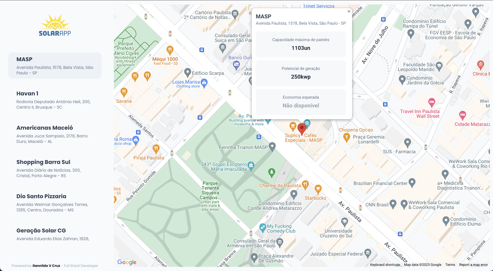
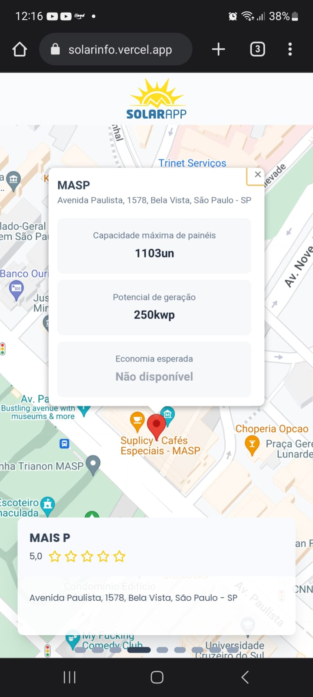

# Solar Info

## Descrição

O Solar Info é uma aplicação web que permite aos usuários encontrar informações sobre a energia solar disponível em um determinado endereço. Ele utiliza a API Solar do Google para obter dados de irradiação solar e a API de Mapas do Google para buscar endereços. O aplicativo foi desenvolvido com Next.js e estilizado com o Tailwind CSS, proporcionando uma experiência de usuário agradável e responsiva.

## Recursos Principais

- **Busca de Endereços:** Os usuários podem selecionar um endereços na aba lateral para encontrar informações de energia solar para esse local.

- **Dados de Energia Solar:** O aplicativo exibe informações sobre a Paineis solares na área especificada.

- **Visualização no Mapa:** Além das informações textuais, os resultados também são exibidos no mapa, permitindo aos usuários ter uma visão geográfica da distribuição da energia solar.

## Capturas de Tela






## Rodando localmente

1. Clone o projeto

```bash
  git clone git@github.com:Ilannildo/solarinfo.git
```

2. Entre no diretório do projeto

```bash
  cd solarinfo
```

3. Instale as dependências

```bash
  npm install
```


4. Configure as chaves da API do Google:

- Crie um arquivo `.env.local` na raiz do projeto.

- Adicione suas chaves da API do Google e a API de endereços ao arquivo `.env.local`:

  ```
  NEXT_PUBLIC_API_URL=https://challenge.solarpipe.com.br/
  NEXT_PUBLIC_API_GOOGLE_URL=https://solar.googleapis.com/v1/buildingInsights:findClosest
  NEXT_PUBLIC_GOOGLE_MAP_API_KEY="YOUR_API_KEY"
  ```

4. Inicie o servidor

```bash
  npm run dev
```


6. Acesse o aplicativo em seu navegador em `http://localhost:3000`.

## Tecnologias Utilizadas

- [Next.js](https://nextjs.org/)
- [Tailwind CSS](https://tailwindcss.com/)
- [API Solar do Google](https://console.cloud.google.com/apis/library/solar.googleapis.com)
- [API de Mapas do Google](https://console.cloud.google.com/apis/library/maps-backend.googleapis.com)

## Contribuição

Sinta-se à vontade para contribuir para o desenvolvimento deste projeto. Você pode abrir issues, enviar pull requests e compartilhar suas ideias.

## Autor

- Ilannildo V da Cruz
- GitHub: [ilannildo](https://github.com/ilannildo)

## Licença

Este projeto está licenciado sob a Licença MIT - consulte o arquivo [LICENSE](LICENSE) para obter detalhes.
